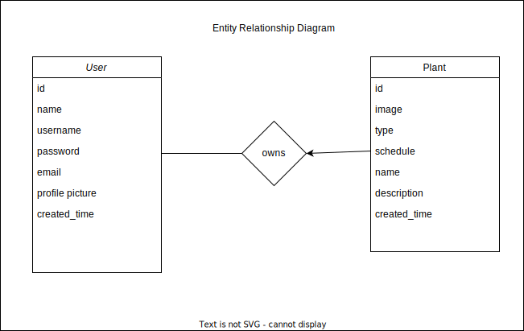

# ER Diagram Explanation

In our application we have two entities, **User** and **Plant**. Between these two sets there exists a 1:Many relationship we call **Owns**. ~~This will act as our **bridge table**.~~ Our relationship is 1:Many because one user can have many plants of the same type on the same schedule. Instead of creating and managing a bridge table, I believe we can manage using sqlalchemy [relationships](https://docs.sqlalchemy.org/en/20/orm/basic_relationships.html#one-to-many:~:text=One%20To-,Many,-%C2%B6)

## User
Has the primary key as its id

## Plant
Has the primary key as its id as well